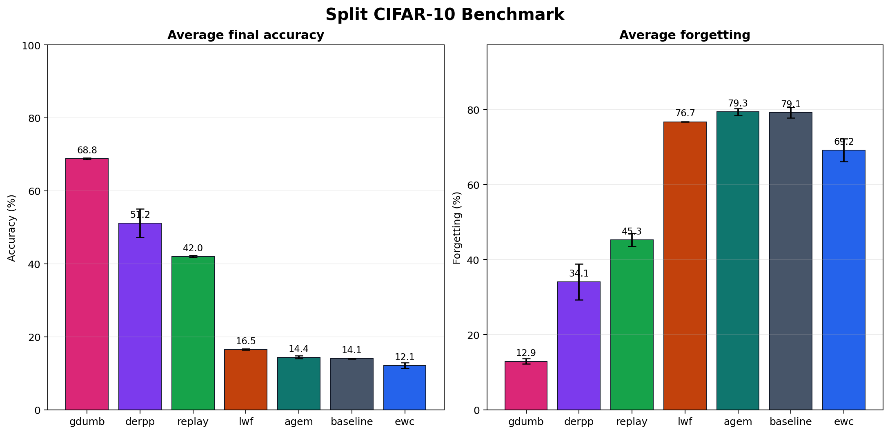
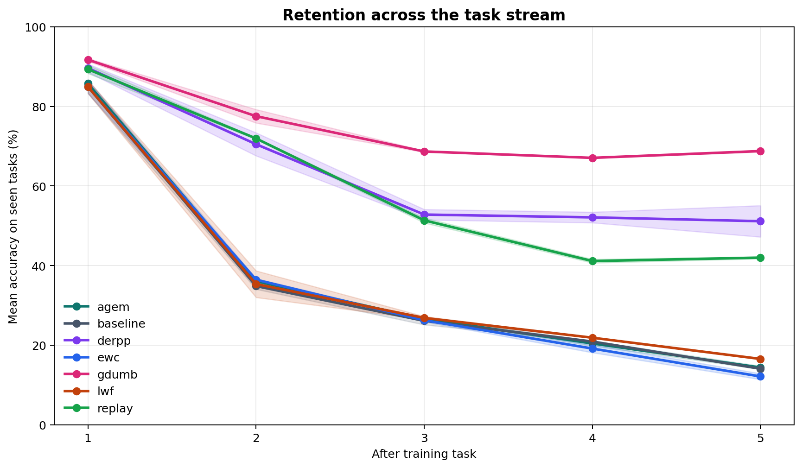
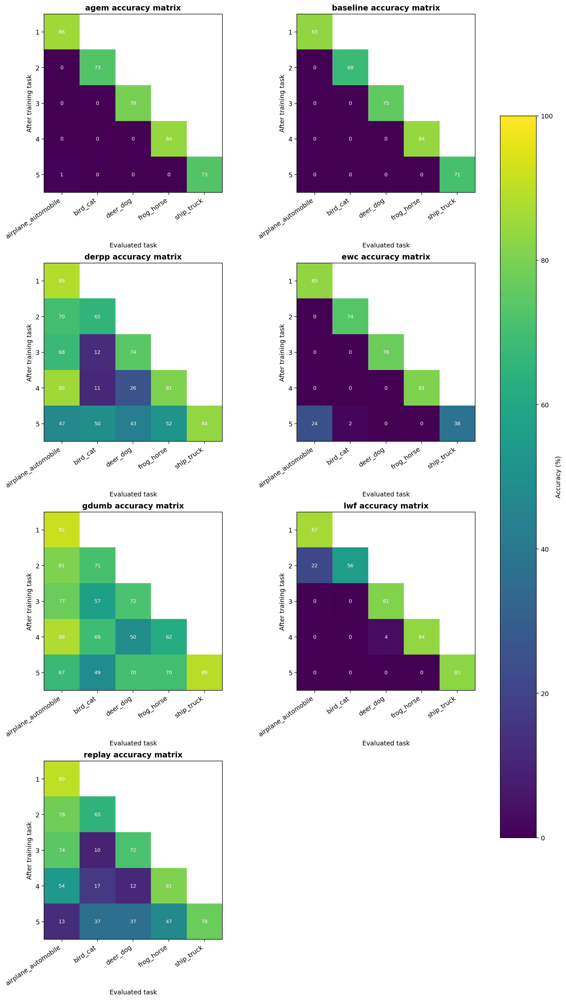

# Split CIFAR-10 Benchmark

Benchmarks: `split_cifar10_headline`
Runs: `14`
Tasks per run: `5`

## Leaderboard

| Method | Runs | Seeds | Memory | Final accuracy | Forgetting | Backward transfer | Mean runtime |
| --- | ---: | --- | ---: | ---: | ---: | ---: | ---: |
| gdumb | 2 | 13,21 | 10000 | 68.78 +- 0.22% | 12.89 +- 0.71% | -11.93% | 2020.4s |
| derpp | 2 | 13,21 | 5000 | 51.15 +- 3.95% | 34.06 +- 4.74% | -34.06% | 578.7s |
| replay | 2 | 13,21 | 5000 | 41.99 +- 0.27% | 45.27 +- 1.73% | -45.27% | 547.4s |
| lwf | 2 | 13,21 | 5000 | 16.53 +- 0.13% | 76.71 +- 0.09% | -76.71% | 224.3s |
| agem | 2 | 13,21 | 5000 | 14.37 +- 0.39% | 79.34 +- 0.96% | -79.34% | 516.3s |
| baseline | 2 | 13,21 | 5000 | 14.06 +- 0.10% | 79.14 +- 1.39% | -79.14% | 181.0s |
| ewc | 2 | 13,21 | 5000 | 12.12 +- 0.74% | 69.20 +- 3.02% | -69.20% | 223.1s |

## Plots

## Source Runs

| Method | Seed | Run directory |
| --- | ---: | --- |
| agem | 13 | `runs/split_cifar10_headline_agem_20260525T133221Z` |
| agem | 21 | `runs/split_cifar10_headline_agem_20260525T141129Z` |
| baseline | 13 | `runs/split_cifar10_headline_baseline_20260525T130248Z` |
| baseline | 21 | `runs/split_cifar10_headline_baseline_20260525T134059Z` |
| derpp | 13 | `runs/split_cifar10_headline_derpp_20260525T132220Z` |
| derpp | 21 | `runs/split_cifar10_headline_derpp_20260525T140155Z` |
| ewc | 13 | `runs/split_cifar10_headline_ewc_20260525T130553Z` |
| ewc | 21 | `runs/split_cifar10_headline_ewc_20260525T134413Z` |
| gdumb | 13 | `runs/split_cifar10_headline_gdumb_20260525T160424Z` |
| gdumb | 21 | `runs/split_cifar10_headline_gdumb_20260525T163726Z` |
| lwf | 13 | `runs/split_cifar10_headline_lwf_20260525T131842Z` |
| lwf | 21 | `runs/split_cifar10_headline_lwf_20260525T135744Z` |
| replay | 13 | `runs/split_cifar10_headline_replay_20260525T130954Z` |
| replay | 21 | `runs/split_cifar10_headline_replay_20260525T134756Z` |
