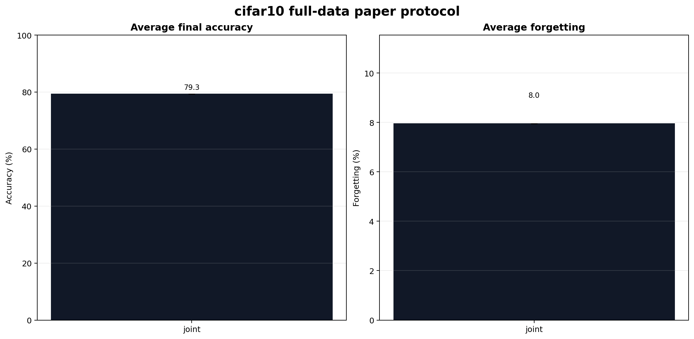
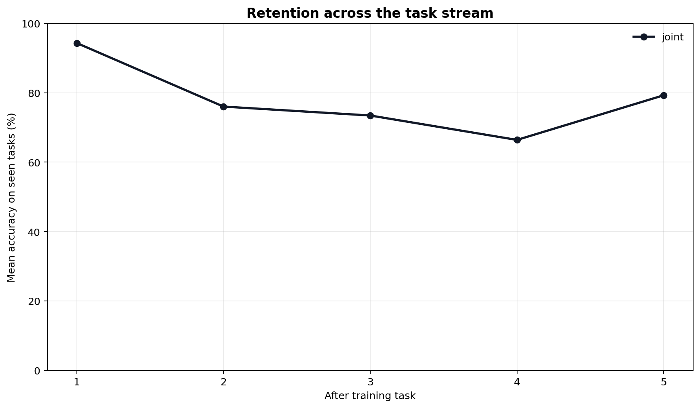
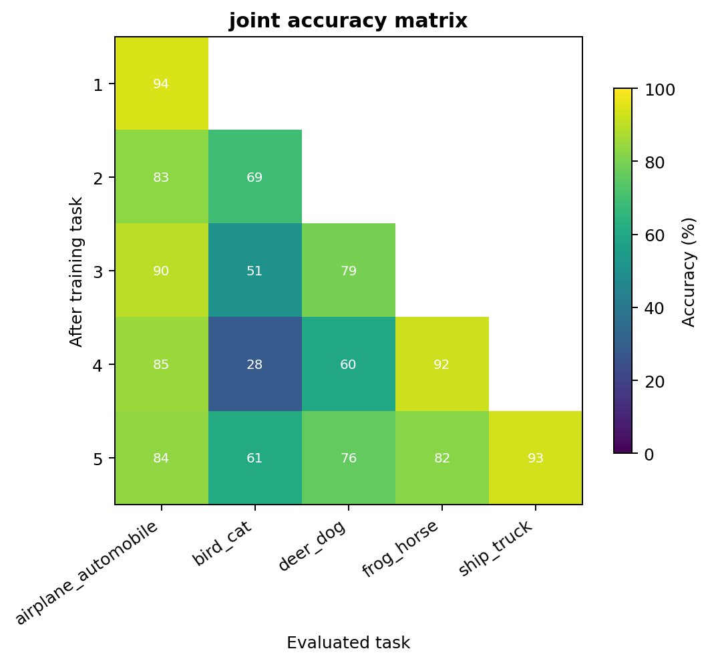
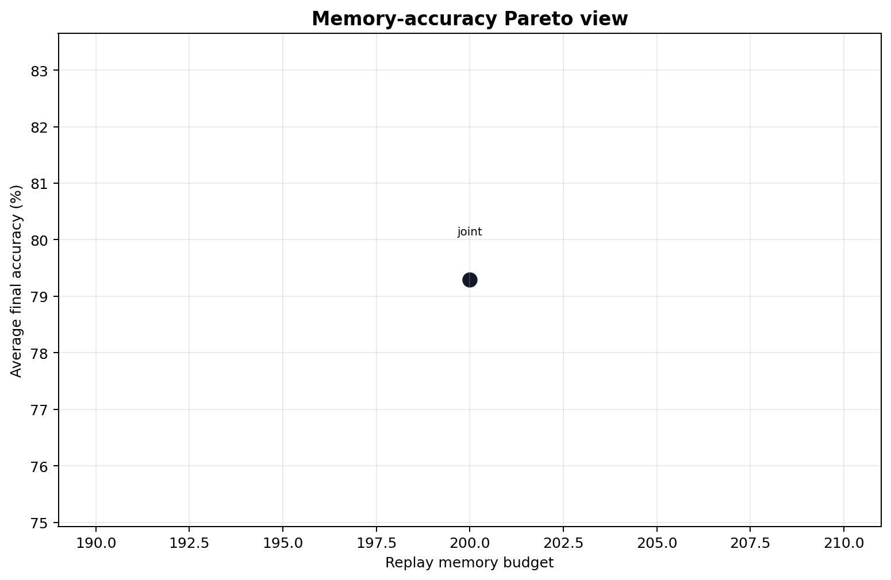
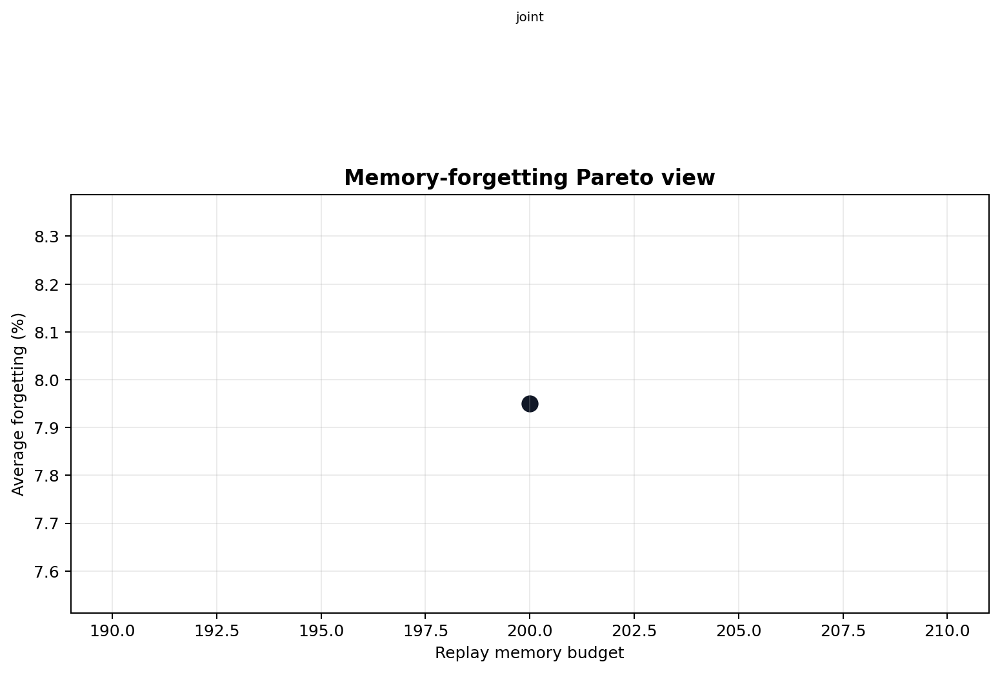
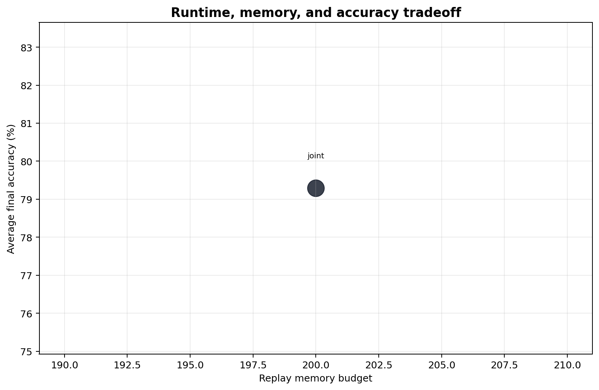

# cifar10 full-data paper protocol

Benchmarks: `split_cifar10_full`
Runs: `1`
Tasks per run: `5`

> Transfer snapshot: this report is intentionally incomplete. It contains only
> the first completed full-data run before the experiment suite was stopped for
> migration to a CUDA laptop. Do not use it for CAR, replay, DER++, ER-ACE, or
> Pareto-frontier claims.

## Leaderboard

| Method | Runs | Seeds | Memory | Final accuracy | Forgetting | Backward transfer | Forward transfer | Mean runtime |
| --- | ---: | --- | ---: | ---: | ---: | ---: | ---: | ---: |
| joint | 1 | 13 | 200 | 79.29% | 7.95% | -7.95% | -13.18% | 13321.3s |

## Plots

## Protocol Notes

Rows are aggregated by method and replay-memory budget. Compare rows with the same memory budget and model family for matched-protocol claims.

## Source Runs

| Method | Seed | Run directory |
| --- | ---: | --- |
| joint | 13 | `runs/paper/split_cifar10_full_joint_20260526T023932Z` |
